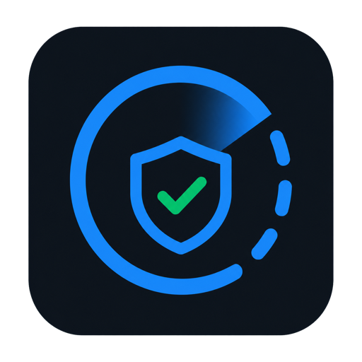

<p align="center">
  
</p>

<h1 align="center">Codex Mac Cleaner</h1>

<p align="center">
  <strong>Очистка вашего Mac от мусора, который могут пропустить даже платные
  приложения из App Store.</strong>
</p>

<p align="center">
  Освободите место на диске прямо в Codex — без отдельного приложения для
  очистки и ручных команд после запуска.
</p>

<p align="center">
  <a href="https://github.com/stasdzzen/Codex-Mac-Cleaner/actions/workflows/repository.yml">
    
  </a>
  
  
  <a href="LICENSE">
    
  </a>
</p>

<p align="center">
  <a href="#установка">Установка</a> ·
  <a href="#как-запустить">Как запустить</a> ·
  <a href="#как-устроена-безопасность">Безопасность</a> ·
  <a href="docs/index.md">Документация</a>
</p>

> [!WARNING]
> `v0.1.0-beta.12` — тестовая версия. Автоматические проверки проходят в
> изолированных временных каталогах, но эту сборку ещё нужно вручную проверить
> на реальном Mac. Не используйте её для очистки ценных данных без резервной
> копии.

## Что делает плагин

После удаления приложения на Mac могут остаться кэши, журналы и другие
ненужные файлы. Обычная очистка не всегда их показывает. Codex Mac Cleaner
проверяет личную системную папку `~/Library` («Библиотека»), находит такие
остатки и объясняет, почему их можно считать мусором.

Для каждого найденного объекта плагин показывает:

- понятное название и предполагаемого владельца;
- размер файлов и место, которое они занимают на диске;
- почему объект найден и насколько уверен плагин;
- риск и причину, по которой действие может быть заблокировано.

Плагин ничего не удаляет сам. Пользователь отдельно выбирает действие для
одного объекта: оставить, переместить в карантин, восстановить или удалить из
карантина навсегда. Массового удаления и кнопки «Выбрать всё» нет.

## Требования

- macOS 26 или новее;
- Mac с процессором Apple M1 или новее (`arm64`);
- Codex с поддержкой команды `codex plugin`;
- Node.js `24.18.x`.

Intel Mac, Rosetta и старые версии macOS не поддерживаются.

## Установка

Один раз добавьте репозиторий как источник плагинов и установите текущую
версию. Команды нужно выполнить в Терминале только при первой установке:

```bash
codex plugin marketplace add stasdzzen/Codex-Mac-Cleaner --ref v0.1.0-beta.12
codex plugin add codex-mac-cleaner@codex-mac-cleaner
```

Проверьте установку:

```bash
codex plugin list
```

После установки полностью закройте Codex и откройте его снова.

## Как запустить

1. Создайте новую задачу Codex.
2. Выберите плагин **Codex Mac Cleaner**.
3. Напишите:

> Проверь Mac на остатки удалённых приложений и открой результаты.

Интерфейс откроется в Codex и сразу покажет ход проверки. Копировать команды в
терминал после запуска не нужно.

## Как обновить предыдущую версию

Удалять источник плагинов или установленный плагин не нужно. Если у вас
установлена `v0.1.0-beta.11` или более ранняя версия, создайте новую задачу,
выберите Codex Mac Cleaner
и напишите:

> Обнови Codex Mac Cleaner до v0.1.0-beta.12.

Навык обновления проверит тег в официальном репозитории, переключит источник
плагина, установит новую версию и проверит результат. Если обновление
прервётся, он попробует вернуть прежнюю версию.

После успешного обновления полностью закройте Codex, откройте его снова и
создайте новую задачу. Уже открытая задача продолжает использовать прежнюю
версию плагина.

## Как устроена безопасность

- Проверка выполняется локально. Телеметрия и отправка найденных файлов в сеть
  не используются.
- Полные пути, пароли, токены и адреса подписок не показываются модели и не
  попадают в журнал проверки.
- Плагин повторно проверяет объект непосредственно перед перемещением.
- Первый шаг — собственный карантин, а не прямое удаление.
- Восстановление и окончательное удаление требуют отдельных нажатий.
- Запущенные приложения, открытые файлы, личные данные, локальные Git-проекты и
  защищённые области macOS нельзя очистить этой версией.
- Ошибка доступа macOS не приводит к совету использовать `sudo` или обходить
  системную защиту.

Размер найденных файлов не равен гарантированному приросту свободного места:
файловая система macOS может совместно использовать место и обновлять
показатели диска не сразу.

Подробнее: [модель безопасности](docs/safety/safety-model.md) и
[границы первой версии](docs/foundation/scope-and-principles.md).

## Ограничения предварительной версии

Первая версия работает только с личной системной папкой пользователя
`~/Library` и остатками обычных приложений. Она не изменяет системную папку
`/Library`, не использует `sudo`, не управляет системными службами, Homebrew и
средами разработки.

Фоновая и автоматическая проверка пока не выполняется. Пользователь запускает
её сам кнопкой в интерфейсе.

Текущие заметки: [v0.1.0-beta.12](docs/release/v0.1.0-beta.12.md). Ручная
проверка на реальном Mac описана в
[отдельном протоколе](docs/release/real-mac-smoke.md).

## Для разработчиков

```bash
pnpm install --frozen-lockfile
pnpm check
node scripts/package-release.mjs --verify-only
```

Сборщик дважды создаёт пакет во временных каталогах и сравнивает состав и
контрольные суммы. В архив также входят перечень зависимостей и сведения о
происхождении сборки.

Основные документы:

- [архитектурный канон](docs/index.md);
- [PRD](docs/product/PRD-codex-mac-cleaner.md);
- [контракт выполнения](docs/development/execution-contract.md);
- [правила публичного репозитория](docs/development/public-repository-policy.md);
- [источники и благодарности](ACKNOWLEDGEMENTS.md).

## Участие и поддержка

Перед изменениями прочитайте [правила участия](CONTRIBUTING.md) и выберите одну
задачу GitHub. Об ошибке можно сообщить через форму, а идеей поделиться в
[GitHub Discussions](https://github.com/stasdzzen/Codex-Mac-Cleaner/discussions/categories/ideas).

Не публикуйте сведения об уязвимостях в задачах и запросах на слияние. Используйте
[закрытое сообщение об уязвимости](https://github.com/stasdzzen/Codex-Mac-Cleaner/security/advisories/new)
и правила из [SECURITY.md](SECURITY.md).

Поддержать развитие проекта можно будет на
[странице Dzzen](https://dzzen.com/support). Страница будет опубликована позже.

## Лицензия

Проект распространяется по лицензии Apache 2.0. Полный текст находится в
[LICENSE](LICENSE).
